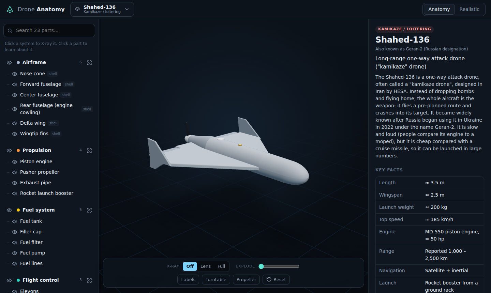
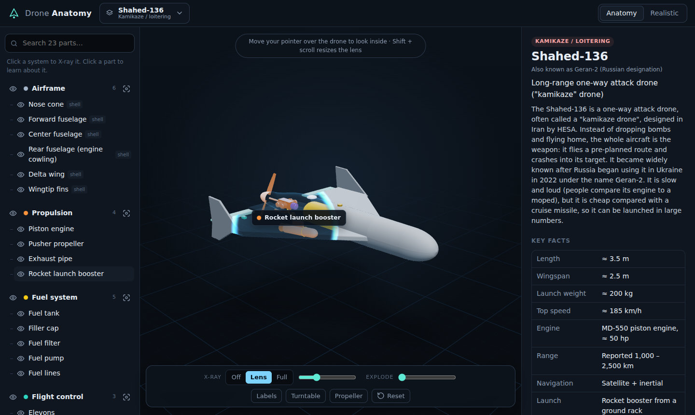
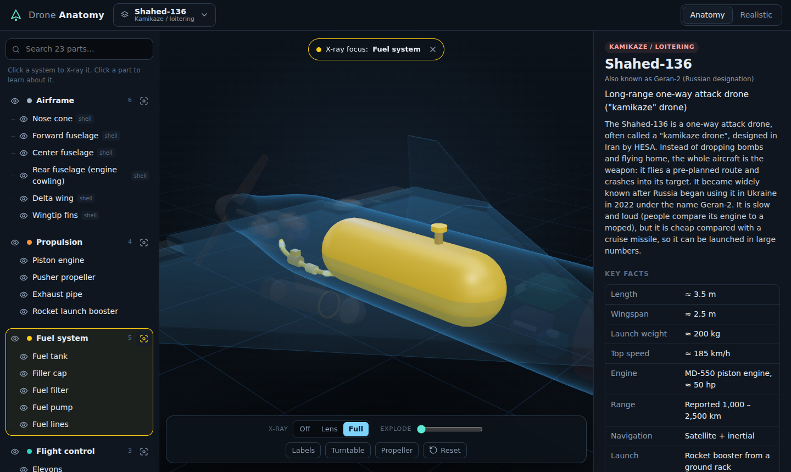
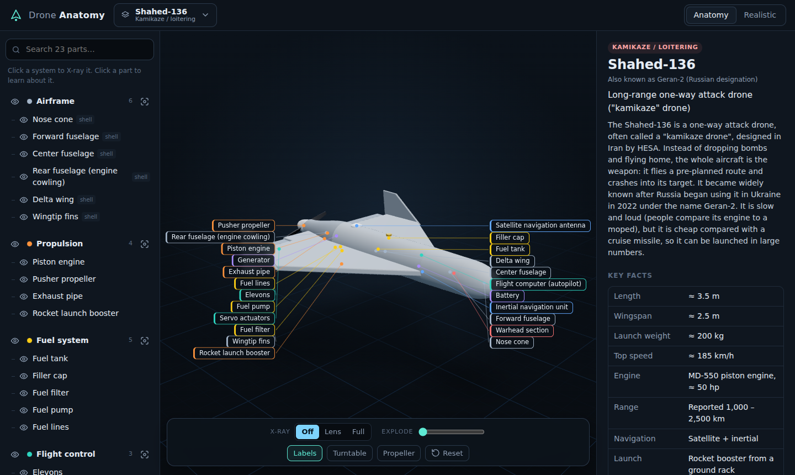

# Drone Anatomy

An interactive 3D "anatomy app" for drones, like the human-anatomy apps, but for UAVs.
You can spin a drone 360°, X-ray it to see inside, pull it apart, and tap any part to learn what it does.



The first drone is the **Shahed-136**, a long-range one-way attack ("kamikaze") drone. Interceptors, FPV drones and the rest of the catalog are next (see the [roadmap](#roadmap)).

| X-ray lens | Fuel system X-ray | Every part labelled |
| --- | --- | --- |
|  |  |  |

## Features

- **360° viewer**: drag to rotate, scroll or pinch to zoom, right-drag to pan. The turntable spins it on its own.
- **X-ray, three modes**
  - **Lens**: a see-through circle follows your pointer (or finger) so you can look inside. Parts under the lens light up, and hovering one shows its name. Shift + scroll resizes the lens.
  - **Full**: the whole shell turns to glass.
  - **System focus**: click a system (for example **Fuel system**) to X-ray it. Its parts glow and everything else fades. Fuel visibly flows from the tank through the filter and pump to the engine.
- **Tap any part** to fly the camera to it and read what it does, a "Did you know?" fact and key specs. Parts inside the shell switch X-ray on by themselves.
- **Labels**: callouts name every part at once, and hovering a label highlights its part.
- **Explode**: the shell lifts away to show the internals in place.
- **Layers**: show, hide or isolate any part or whole system (airframe, propulsion, fuel, flight control, navigation, power, payload).
- **Realistic tab**: the detailed [Sketchfab model](https://sketchfab.com/3d-models/hesa-shahed-136-3d-cad-model-e09fba235055433ba7bb7fb5a0d4da87) by nitroexpress, embedded with Sketchfab's player.
- **Library**: every drone category (kamikaze, interceptors, multirotor, fixed-wing, VTOL, helicopter, nano, utility).
- Works on phones, tablets and desktops. Keyboard shortcuts: `X` X-ray · `E` explode · `L` labels · `R` reset · `Esc` deselect.

## Run it

```bash
npm install
npm run dev        # http://localhost:5173/Anatomy/
```

| Command | What it does |
| --- | --- |
| `npm run build` | Type-check and build to `dist/` |
| `npm test` | Data tests (vitest) |
| `npm run test:e2e` | Browser tests with Playwright. They also save screenshots to `screenshots/` |

### Publish it (free)

1. On GitHub: **Settings → Pages → Source: GitHub Actions**.
2. Push to `main` (or run the *Deploy to GitHub Pages* workflow by hand).
3. The app goes live at `https://<your-user>.github.io/Anatomy/`.

## How it's built

React + TypeScript + [three.js](https://threejs.org) via [react-three-fiber](https://r3f.docs.pmnd.rs), plus [drei](https://drei.docs.pmnd.rs) helpers and [zustand](https://zustand.docs.pmnd.rs) for state.

```
src/
  data/drones/shahed136.ts      what each part is: text, specs, system, explode direction
  data/drones/index.ts          drone registry + library catalog
  data/systems.ts               the 7 colour-coded systems
  models/shahed136/…Model.tsx   the 3D model, built from code; one <Part id> per part
  models/geometry.ts            shape helpers (body of revolution, wing plates, twisted blades)
  viewer/Part.tsx               picking, highlight, hide/isolate, focus, explode, X-ray per part
  viewer/xray.ts                shader patch for the X-ray lens and glass shell
  viewer/FlowLine.tsx           pipes with animated flow (fuel lines)
  viewer/Labels.tsx             hover name tag + callout columns
  viewer/CameraRig.tsx          orbit controls, fly-to, turntable
  ui/                           parts tree, info panel, toolbar, library, realistic tab
```

The 3D model is **built from code** (no model files), so every part is its own clickable piece and the app has no licensing issues. The data layer also supports glTF models (`model: { kind: 'gltf', url, nodeMap }`), so a detailed Blender or purchased model can replace the code-built one later.

### Adding a drone

1. Add `src/data/drones/<id>.ts` with its parts, and register it in `src/data/drones/index.ts` (set its catalog entry to `live`).
2. Add `src/models/<id>/<Name>Model.tsx`, wrapping each part's meshes in `<Part id="…">`, and register it in `src/models/index.ts`.
3. `npm test` checks that the model and the data use exactly the same part ids.

## Content guideline

This is an educational app for students and the general public. Military drones are described at **encyclopedia / museum-exhibit level**: what each part is and does, approximate figures that have been publicly reported (marked as such), history, and how the drones are countered. It doesn't include warhead or fuze internals, construction or sourcing details, or anything about modifying guidance or payloads.

## Roadmap

- **Next**: FPV kamikaze quad (brings a reusable parts kit: motors, ESCs, flight controller, props, battery), Lancet, Coyote-style jet interceptor, FPV interceptor.
- **Then**: Switchblade, camera quadcopter, TB2-style, Reaper-style MALE, Global Hawk-style HALE, VTOL quadplane, helicopter drone, nano drone, delivery and agricultural drones.
- **Later**: side-by-side compare mode, quiz mode, offline install (PWA), glTF model loader.

## Credits

- Realistic view: [HESA Shahed 136 3D CAD Model](https://sketchfab.com/3d-models/hesa-shahed-136-3d-cad-model-e09fba235055433ba7bb7fb5a0d4da87) by [nitroexpress](https://sketchfab.com/Bullet3D) on Sketchfab, shown with Sketchfab's embed player.
